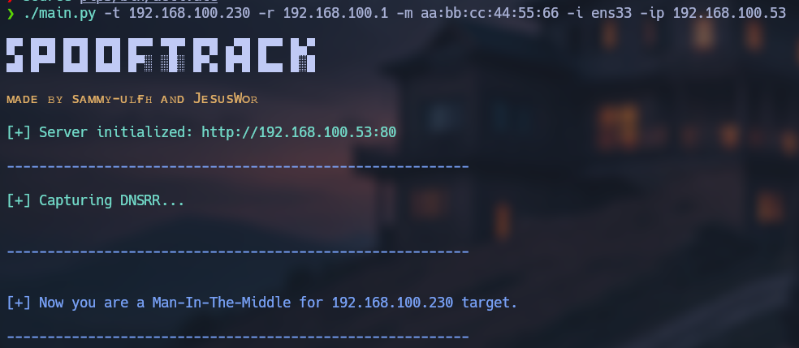
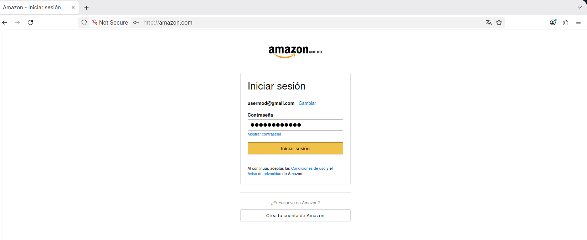
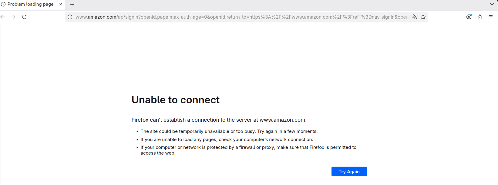
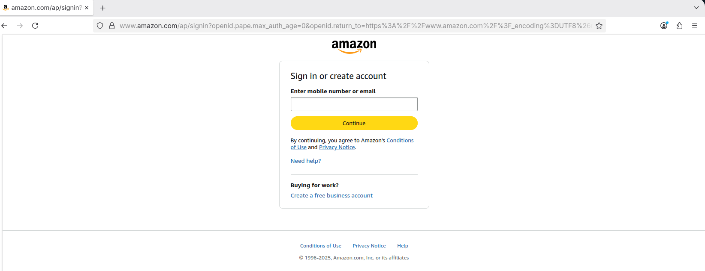
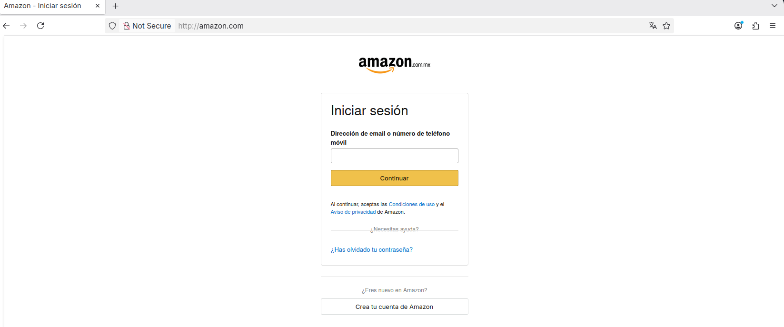
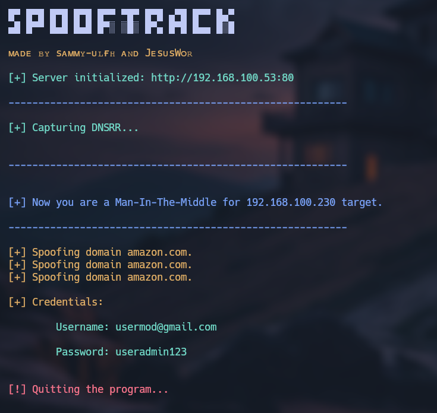

# Spoof Track

<p align="center">
    
</p>


**Spoof Track** is a tool designed to capture credentials from **amazon.com** for a target device connected to the same Wi-Fi network as yours. This program deceives the target device by redirecting the user to a server under you control, which simulates the **Amazon login** page to capture login credentials. Afterward, it redirects the user back to the real Amazon login page, temporarily disrupting the internet connection to make the error appear as a "no Wi-Fi connection."

You can use it by providing the following options:<br/>
    **-t (target IP)**<br/>
    **-r (router IP)**<br/>
    **-m (your MAC address)**<br/>
    **-i (network interface)**<br/>
    **-ip (your IP address where the server will run)**<br/>


<p align="center">
    
</p>

## Table of contents

- [First stepts](#what-do-i-need-to-run-it)
- [Neccesarry steps before running](#how-does-it-work)
- [How to run it](#how-do-i-use-it)

## What do I need to run it?

1. First, clone the repository:

    ```git
    git clone https://github.com/sammy-ulfh/SpoofTrack.git
    ```

2. Then, navigate to the **SpoofTrack/tool/script** directory.

3. Next, install required libraries using pip:

    ```pip3
    pip3 install -r requirements.txt
    ```

4. Next, navigate to the **SpoofTrack/tool/script/web_server** directory and install required dependencies:

    ```nmp
    npm install path fs express
    ```

5. Next, add some rules using the **iptables** tool:

    ```shell
    iptables -I INPUT -j NFQUEUE --queue-num 0
    iptables -I OUTPUT -j NFQUEUE --queue-num 0
    iptables -I FORWARD -j NFQUEUE --queue-num 0
    iptables --policy FORWARD ACCEPT
    ```
    <br/>
    Then, set the value 1 in the ip_forward file to enable ip forwarding:

    ```shell
    echo 1 > /proc/sys/net/ipv4/ip_forward
    ```
    <br/>
    All of these rules redirect the traffic to an NFQUEUE, and we can bind to the queue using its number - in this case 0.


## How does it work?

**SpoofTrack** is a tool that performs an attack in a few steps:

1. First, run a server on your computer that serves a fake Amazon login page.

    <p align="center">
        
    </p>

    When the user completes the login, we capture the credentials and then redirect the user to the real Amazon login page. Simultaneously, we disable the user's internet connection for a few minutes to make the failed login appear as a result of a bad connection.

    <p align="center">
        
    </p>

    Once the user regains their internet connection, they will see the real Amazon login page.

    <p align="center">
        
    </p>


2. Next, traffic is redirected to an NFQUEUE using iptables rules.

    DNS spoofing is then applied to intercept and modify DNS responses, directing the target device to our IP address and redirecting it to our server.

    <p align="center">
        
    </p>


3. Finally, apply ARP spoofing to the target device to enable the capture of all its network traffic.

With these steps, we can obtain the target's credentials and then terminate the attack.

<p align="center">
    
</p>

Additionally, the captured credentials are saved in a file named **credentials.txt** located in the **SpoofTrack/tool/script/web_server** directory.

## How do I use it?

Now, you understand how the tool works and what is needed to run it. Finally, you need to provide the following arguments when executing the **main.py** file located in the **SpoofTrack/tool/script directory**.

You must specify the following options:

- **t (target IP):**<br/>
    Ex: -t "192.168.100.130"

- **r (router IP):**<br/>
    Ex: -r "192.168.100.1"

- **m (your MAC address):**<br/>
    Ex: -m "aa:bb:cc:22:44:55"

- **i (network interface):**<br/>
    Ex: -i "wlan0"

- **ip (your IP address where the server will run):**<br/>
    Ex: -ip "192.168.100.134"

Then, the tool will work:

<p align="center">
    
</p>
